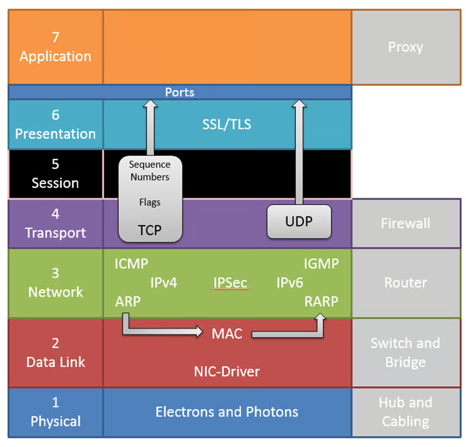

# Layer 5, 6, 7

The top layers of the model are less easy for us to map to real purposes in data communication and tend to get aggregated together by us networking people.&#x20;

In theory layer 5 maintains session information between two hosts (but didn’t we do that with TCP at layer 4?).&#x20;

Layer 6 is about presenting data to the final application, which lives at layer 7.&#x20;

The reality, some of our protocols bridge layers, break layers, etc.&#x20;

It is after all, only a model.

<figure><figcaption></figcaption></figure>

## Security&#x20;

The ultimate way to secure hosts is to have a firewall which is _application aware_. We call these layer 7 firewalls or proxies and we can use them to monitor and control traffic even where it uses anomalous ports.&#x20;

We can take a similar approach to securing services; we can use a _Web Application Firewall_ (WAF), where the traffic to and from a server is understood at the application level.
